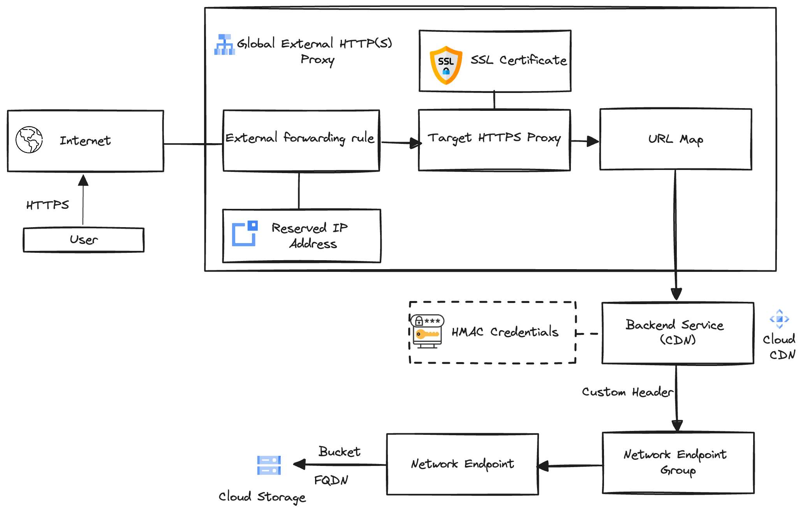

# A publicly accessible private GCS bucket 
The repo contains more or less the resources necessary to expose a private GCS bucket publicly behind a google HTTP/HTTPS load balancer. 
It certainly needs improvements and that will come in the near future.

**_NOTE:_** For more ib depth explanation of the resources used check this article on Medium. (Insert Link to article)

## Architectural Diagram
  **Figure 1.** Diagram of GCP resources .
